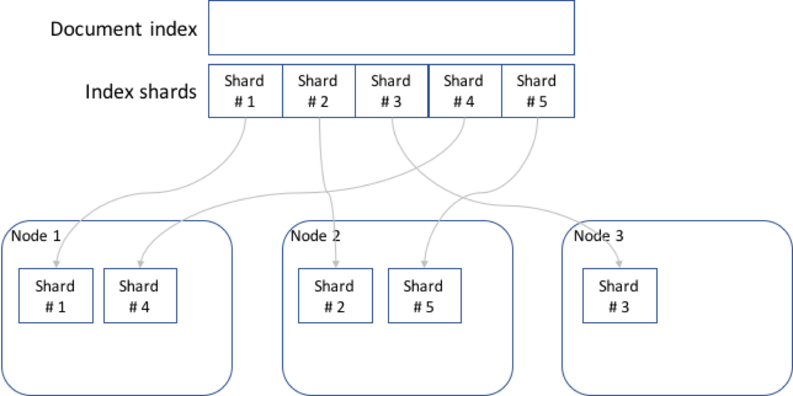

# How does number_of_replicas work?  

```SHELL
curl -X PUT "localhost:9200/customer/_settings?pretty" -H 'Content-Type: application/json' -d' 
{
     "index" : {
         "number_of_replicas" : 2
     }
}
```

The `_settings` are the settings of Elasticsearch configuration of an index. In the settings of an index, the number of shards and replicas can be defined.  

### Elastic search node

When an instance of Elasticsearch is instanced you are starting a node. A collection of connected nodes is a `cluster`.

### What is an index

An index refers, in comparison, to a collection in a database.

### What is a shard

The shards are pieces of information where Elasticsearch distributes the information. Each document in an index belongs to a primary shard and a replica is a copy of this primary shard.

In summary, the shards are the documents that cointain smaller pieces of information. It cointains a small part of the information of the index so it can be more easy to search through it.



#### Are these shards saved in the disk drive

Yes, the shards and all the data are saved in the disk drive. But they can be distributed in multiple nodes. This could make the process a little dificult but it depends on the hardware that is being used, it is recommended to use SSDs or use virtualize storage. Also, the nodes helps with performance.

### How does Elasticsearch distribute the information between shards/replicas

Indexes distribute the information in shards, replicas are not used to distribute information. The replicas are just copies of the primary shards.

An index distributes the information in shards, elasticsearch tries to balance them. They can be rebalanced by modifiying the router but usually elasticsearch tries to keep a balance of how many information is in the shards.

## How does Elasticsearch access these pieces of information

When a request is received by a node, that node forwards the request to the relevant nodes that cointain the relevant shards, then it gathers and combine the responses and send a single response back.

## How does then index distribute the information in shards, is there an algorithm for this?

A document is routed to a particular shard in an index using the formula:
`
shard_num = hash(_routing) % num_primary_shards
`
with this formula elastic search decides in which shard the document will be stored. 

** _routing is a metadata field in each document, by default it is the ID of the document

## How does elastic search try to balance the shards

When a shard is created the algorithm use is BalancedShardsAllocator tries to allocate the shards in the nodes in the cluster as evenly as possible, this means that have more less the same number of shards. This same algorithm rebalance the nodes based on a WeightFunction that uses the settings of the cluster.

### Replicas

The number of replicas refers to the number of “backups” that the database, in this case, backups of the shards, will have. The replicas have as purpose, assure the availability.

### How they assure availability

They cointain the same information as the primary shards, but they can not be modify. They are use to read information and release work on the primary shards. Also, they provide protection againts hardware failure.

By indicating the number of replicas in the settings we indicate the times an index will be backed up. By default, the number of replicas is 1.

### Number of replicas

The number of replicas can be dynamically updated by updating the settings of an index

The settings can be updated by the PUT request with the target and the word _settings

```SHELL
    PUT /<target-index>/_settings
```

Replicas provide redundant copies of your data to protect against hardware failure and increase the capacity to serve read requests like searching or retrieving a document. It is only possible to write in a primary shard, but replicas can be used to read information.

### What happen when add or substract a replica in number of replicas

 The replicas can be dynamically changed. If added, a new replica of the index is created.
 When a replica is substracted, it is just deleted without any harm to the primary shard.
