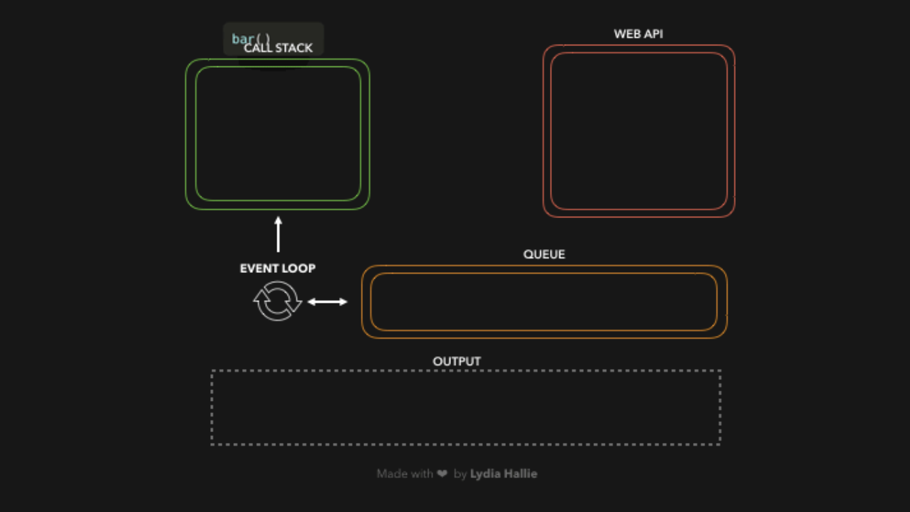

# How do timers work with the asynchrony of JavaScript? 

There are two types of timers: 

* SetTimeout : allows to delay the execution of a function 

* SetInterval: allows to run a code in a loop with intervals in between 

JavaScript works in a single thread, so the delays, and timers are not part of JavaScript but part of the window timers in the WEB API (the browser). 

As running in a single threat, there is no concept as delaying, because this will cause the browser to get blocked. 

The relationship between the `timers` and `JavaScript` is done by the event loop. 

 
 [Event Loop](https://dev.to/lydiahallie/javascript-visualized-event-loop-3dif )

The event loop works with different parts: 

* The heap → memory allocation without any order, where the objects are allocated 

* Stack of methods → single threat that follows the LIFO (last in first out) that keeps track of the current function in execution 

* Web API’s → This includes the DOM API, ajax requests, `setTimeout`, `SetInterval`, HTTP requests, etc. 

* Queue of callbacks  → where the callbacks from the api’s are added before they pass to the stack

Where the stack of methods are for the functions to be executed, the webApi's receives the functions that are not Js functions and the queue of callbacks are the queue of responses from the WebApis ready to pass to the stack of methods (be executed). 
`no callback is executed until the stack of methods is empty`

Even though `setTimeOut` and `SetInterval` are used with an indicator of time 

```Javascript
setTimeout( 

function callback1() {  

   console.log('this is a message from callback1');  

}, 0); 
```

This time is `not guaranteed`, this means that if a `setTimeout` or `setInterval` is sent with time 0, it is not guaranteed that the code will be executed instantly. This is because it depends on the event loop and the number of tasks in the queue of callbacks that are waiting to pass to the stack of methods, and then, executed by JavaScript. 

In summary, timers are handled by the WebApi, but the outcomes, the callbacks come back to the queue of the event loop of JS and then they are executed.

## How JS knows how how many time has elapsed, and has to execute the callback

The callback is in the queue of the Javascript event loop, ready to pass to the call stack and be executed, `but how does Javascript knows?`

* The event loop updates its time when the timer first enters and sends it to the WebApi
* It takes the timer with the shortest wait time and compares it with its own 
* If the time has elapsed, it queues it to the queue of callbacks
* Javascript executes the callback when the call stack is empty